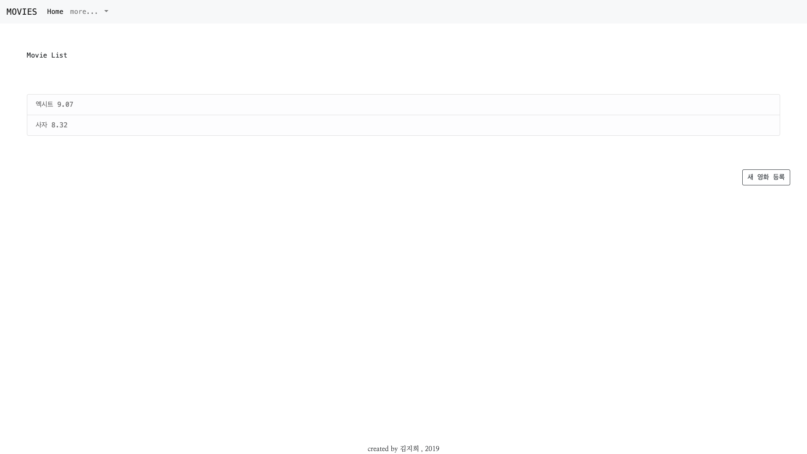
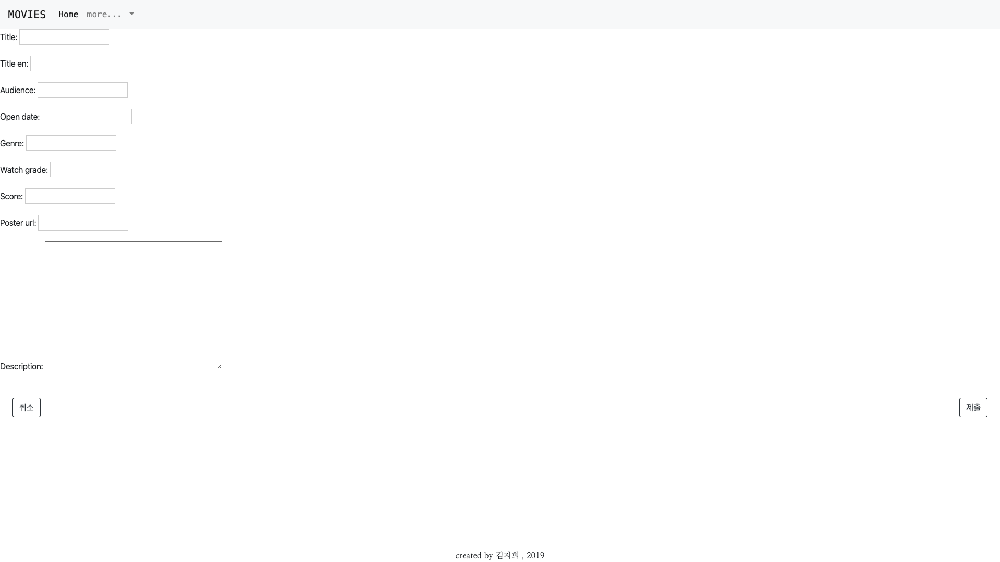
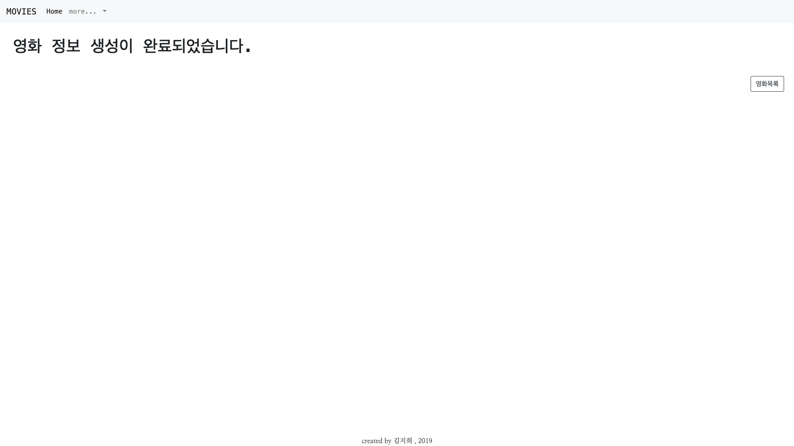
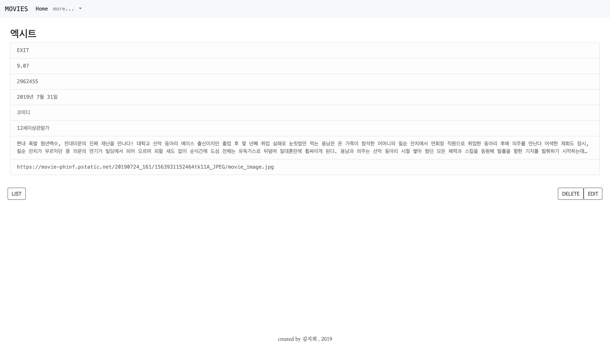
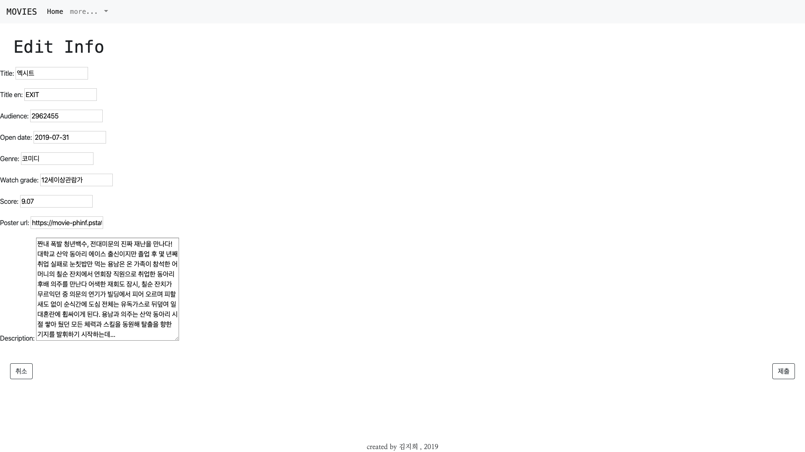

# Project05_Django | 191011

## Goal

-   데이터를 생성, 조회, 삭제, 수정할 수 있는 Web Application 제작
-   Python Web Framework를 통한 데이터 조작
-   Object Relational Mapping 에 대한 이해
-   Template Variable 을 활용한 Template 제작
-   영화 추천 사이트의 영화 정보 데이터 관리


## Getting Started

### Prerequisites

1.  Python Web Framework 사용을 위한 가상환경 설정

    -   ```bash
        $ python -m venv venv
        ```

2.  Python Web Framework - Django

    ```bash
    $ pip install django
    $ pip install django-extensions
    ```

3.  SQLite

    ```bash
    $ brew install sqlite3
    ```

4.  Bootstrap

    ```html
    <head>
        ...
        <link rel="stylesheet" href="https://stackpath.bootstrapcdn.com/bootstrap/4.3.1/css/bootstrap.min.css" integrity="sha384-ggOyR0iXCbMQv3Xipma34MD+dH/1fQ784/j6cY/iJTQUOhcWr7x9JvoRxT2MZw1T" crossorigin="anonymous">
        <link href="https://fonts.googleapis.com/css?family=Nanum+Myeongjo&display=swap" rel="stylesheet">
    
    	...
    </head>
    <body>
        ...
        <script src="https://code.jquery.com/jquery-3.3.1.slim.min.js" integrity="sha384-q8i/X+965DzO0rT7abK41JStQIAqVgRVzpbzo5smXKp4YfRvH+8abtTE1Pi6jizo" crossorigin="anonymous"></script>
    	<script src="https://cdnjs.cloudflare.com/ajax/libs/popper.js/1.14.7/umd/popper.min.js" integrity="sha384-UO2eT0CpHqdSJQ6hJty5KVphtPhzWj9WO1clHTMGa3JDZwrnQq4sF86dIHNDz0W1" crossorigin="anonymous"></script>
    	<script src="https://stackpath.bootstrapcdn.com/bootstrap/4.3.1/js/bootstrap.min.js" integrity="sha384-JjSmVgyd0p3pXB1rRibZUAYoIIy6OrQ6VrjIEaFf/nJGzIxFDsf4x0xIM+B07jRM" crossorigin="anonymous"></script>
    </body>
    ```

5.  Google Font

    ```html
    <head>
        ...
    	<link href="https://fonts.googleapis.com/css?family=Nanum+Myeongjo&display=swap" rel="stylesheet">
        ...
    </head>
    ```


## Start Django

### django project 생성

-   ```bash
    $ django-admin startproject pjt05 .
    ```


### django application 생성

1.  cinema 라는 이름의 앱을 생성한다.

    ```bash
    $ django-admin startapp cinema
    ```

2.  pjt05 / settings.py

    -   위에서 생성한 cinema app을 ``INSTALLED_APPS`` 에 등록해준다.

    -   ``LANGUAGE_CODE`` 를 'ko-kr' 로 바꾼다.

        -   settings.py

            ```python
            ...
            INSTALLED_APPS = [
                'django_extensions',
                'django.contrib.admin',
                'django.contrib.auth',
                'django.contrib.contenttypes',
                'django.contrib.sessions',
                'django.contrib.messages',
                'django.contrib.staticfiles',
                'cinema',
            ]
            ...
            LANGUAGE_CODE = 'ko-kr'
            ...
            ```

3.  pjt05 / urls.py

    -   cinema app 을 작동 시킬 수 있는 url 을 ``urlpatterns`` 에 등록 해준다.

    -   이 때, 필요한 ``path `` 와 ``include`` 를 같이 import 해준다.

        -   urls.py

            ```python
            from django.contrib import admin
            from django.urls import path, include
            
            urlpatterns = [
                path('admin/', admin.site.urls),
                path('movies/', include('cinema.urls'))
            ]
            ```


## Build Application

### models.py

-   영화 관련 정보를 담고 있는 Database 를 생성하기 위해서 정보를 담을 수 있는 model 은 생성한다.

-   영화 제목, 영문 제목, 관람수, 개봉일, 장르, 상영 등급, 평점, 포스터 url, 상세정보 를 저장하기로 정하였고, 다음과 같이 model 을 정의하였다.

    ```python
    from django.db import models
    
    class Movie(models.Model):
        title = models.CharField(max_length=100)
        title_en = models.CharField(max_length=100)
        audience = models.IntegerField()
        open_date = models.DateField()
        genre = models.CharField(max_length=100)
        watch_grade = models.CharField(max_length=100)
        score = models.FloatField()
        poster_url = models.URLField()
        description = models.TextField()
    ```

-   해당 model 을 실제 database 에 적용시키기 위하여 다음과 같이 명령어를 입력한다.

    ```bash
    $ python manage.py makemigrations
    $ python manage.py migrate
    ```


### forms.py

-   위에서 정의한 model data의 입력 및 검증 과 더불어 HTML 생성을 위한 form을 정의 해 준다.

    ```python
    from django import forms
    from .models import Movie
    
    class MovieModelForm(forms.ModelForm):
        class Meta:
            model = Movie
            fields = '__all__'
    ```


### urls.py

-   영화 리스트, 영화 정보 생성, 영화 정보 조회, 영화 정보 수정, 영화 정보 삭제를 위한 url path 를 등록해준다.

    ```python
    from django.urls import path
    from . import views
    
    app_name = 'cinema'
    
    urlpatterns = [
        path('', views.movie_list, name='movie_list'),
        path('create/', views.create_movie, name='create_movie'),
        path('<int:movie_id>/', views.movie_detail, name='movie_detail'),
        path('<int:movie_id>/edit/', views.edit_movie, name='edit_movie'),
        path('<int:movie_id>/delete/', views.delete_movie, name='delete_movie'),
    ]
    ```


### views.py

-   영화 리스트, 영화 정보 생성, 영화 정보 조회, 영화 정보 수정, 영화 정보 삭제 기능을 수행할 수 있도록 views.py 를 작성해준다.

-   필요한 library 를 import 해준다.

    ```python
    from django.shortcuts import render, redirect, get_object_or_404
    from django.views.decorators.http import require_GET, require_POST, require_http_methods
    
    from .models import Movie
    from .forms import MovieModelForm
    
    from IPython import embed
    ```

#### base.html

-   본격적인 html 생성 전에 작업의 간편화를 위해 base 가 될 html 을 작성한다.

-   사용자들의 편의를 위해 nav bar 를 만들었다.

    -   'HOME' 버튼을 만들어 어느 곳에서든 home 사이트로 돌아갈 수 있도록 하였다.
    -   drop down 메뉴 안에 영화 정보 생성 페이지로 연결된 'ADD' 버튼을 만들었다.

-   footer 에 작성자 정보를 작성하였다.

    ``` html
    <!DOCTYPE html>
    <html lang="en">
    <head>
        <meta charset="UTF-8">
        <meta name="viewport" content="width=device-width, initial-scale=1.0">
        <meta http-equiv="X-UA-Compatible" content="ie=edge">
        <link rel="stylesheet" href="https://stackpath.bootstrapcdn.com/bootstrap/4.3.1/css/bootstrap.min.css" integrity="sha384-ggOyR0iXCbMQv3Xipma34MD+dH/1fQ784/j6cY/iJTQUOhcWr7x9JvoRxT2MZw1T" crossorigin="anonymous">
        <link href="https://fonts.googleapis.com/css?family=Nanum+Myeongjo&display=swap" rel="stylesheet">
    
        <title>
        </title>
    </head>
        
    <body>
        <nav class="navbar navbar-expand-lg navbar-light bg-light text-monospace">
            <a class="navbar-brand" href="">MOVIES</a>
            <button class="navbar-toggler" type="button" data-toggle="collapse" data-target="#navbarNavDropdown" aria-controls="navbarNavDropdown" aria-expanded="false" aria-label="Toggle navigation">
                <span class="navbar-toggler-icon"></span>
            </button>
            <div class="collapse navbar-collapse" id="navbarNavDropdown">
                <ul class="navbar-nav">
                <li class="nav-item active">
                    <a class="nav-link" href="">Home <span class="sr-only">(current)</span></a>
                </li>
    
                <li class="nav-item dropdown">
                    <a class="nav-link dropdown-toggle" href="#" id="navbarDropdownMenuLink" role="button" data-toggle="dropdown" aria-haspopup="true" aria-expanded="false">
                    more...
                    </a>
                    <div class="dropdown-menu" aria-labelledby="navbarDropdownMenuLink">
                    <a class="dropdown-item" href="">ADD</a>
                    </div>
                </li>
                </ul>
            </div>
        </nav>
        
        
        <div>
        <footer class="fixed-bottom center" style="font-family: 'Nanum Myeongjo', serif; text-align:center">
            created by 김지희 , 2019
        </footer>
        </div>
    	<script src="https://code.jquery.com/jquery-3.3.1.slim.min.js" integrity="sha384-q8i/X+965DzO0rT7abK41JStQIAqVgRVzpbzo5smXKp4YfRvH+8abtTE1Pi6jizo" crossorigin="anonymous"></script>
    	<script src="https://cdnjs.cloudflare.com/ajax/libs/popper.js/1.14.7/umd/popper.min.js" integrity="sha384-UO2eT0CpHqdSJQ6hJty5KVphtPhzWj9WO1clHTMGa3JDZwrnQq4sF86dIHNDz0W1" crossorigin="anonymous"></script>
    	<script src="https://stackpath.bootstrapcdn.com/bootstrap/4.3.1/js/bootstrap.min.js" integrity="sha384-JjSmVgyd0p3pXB1rRibZUAYoIIy6OrQ6VrjIEaFf/nJGzIxFDsf4x0xIM+B07jRM" crossorigin="anonymous"></script>
    </body>   
    </html>
    ```

    

#### 영화 목록 조회

- urls.py

    - ```    
        urlpatterns = [
        	path('', views.movie_list, name='movie_list')
        	]
        ```

- views.py

    - ```python
        def movie_list(request):
            movies = Movie.objects.all()
            return render(request, 'cinema/movie_list.html', {
                'movies': movies,
            })
        ```

    -   model Movie 에 등록된 data 를 모두 불러온 후 ``movies`` 변수로 받는다.
    -    ``movie_list.html`` 을 통해 render 해준다.

- movie_list.html

    - ```html
        
        
            Movie List
        
        
            <div class="mx-5 mt-5 p-3 text-monospace">
                Movie List
            </div>
            
                <ul class="m-5 p-3 text-monospace">
                
                    <li class="list-group-item list-group-item-light">
                    <a class="text-reset" href="">{{ movie.title }} {{ movie.score }}</a>
                    </li>
                
                </ul>
            
            <div class="m-3 px-4 float-right text-monospace">
                <a href="">
                <button type="button" class="btn btn-outline-dark">새 영화 등록</button>
                </a>
            </div>
        
        ```

    - base.html 의 형식을 이어 받는다.

    - movies data 가 있을 때만 목록이 나오도록 if 문을 작성하였다.

    - data 가 있을 때, 모든 영화 목록이 나타날 수 있도록 for 문을 작성하였다.

    - 영화 정보 생성을 위한 '새 영화 등록' 버튼을 만들었다


#### 영화 정보 생성

-   urls.py

    ```python
    urlpatterns = [
        path('create/', views.create_movie, name='create_movie'),
    ]
    ```

-   views.py

    ```python
    @require_http_methods(['GET', 'POST'])
    def create_movie(request):
        if request.method == 'POST':
            form = MovieModelForm(request.POST)
            if form.is_valid():
                movie = form.save()
                return render(request, 'cinema/created_movie.html')
        else:
            form = MovieModelForm()
        return render(request, 'cinema/new_movie.html', {
            'form': form,
        })
    ```

    -   ``@require_http_methods`` 을 설정하여 입력 정보의 method 가 ``GET`` 이나 ``POST`` 일 때만 정보를 받아 들이도록 제한을 두었다.
    -   ``GET`` method 로 request 가 들어오는 경우는 사용자가 새 영화 정보 등록을 요청한 경우로 form 을 ``new_movei.html`` 과 함께 render 시켜준다.
    -   `` POST`` method 로 request 가 들어오는 경우 사용자가 정보를 입력하여 제출한 경우로, 해당 form의 유효성을 검사 후, 유효한 data 가 입력 된 경우 해당 data 를 database 에 저장하고, 확인 메세지를 보여주는 ``created_movie.html`` 을 render 해준다.

-   _form.html

    ```html
    <form method="POST">
        
        {{ form.as_p }}
        <div class="m-10 p-4">
        <a href=""><button type="button" class="btn btn-outline-dark">취소</button></a>
        <button type="submit" class="btn btn-outline-dark float-right">제출</button>
        </div>
    </form>
    ```

    -   form 을 paragraph 로 제시한다.
    -   작성을 취소할 경우를 위해 영화목록으로 돌아갈 수 있는 링크가 걸린 '취소' 버튼을 만들었다.

-   new_movie.html

    ```html
    
    
    New Movie
    
    
    
    
    ```

    -   ``_form.html`` 을 제시한다._

-   created_movie.html

    ```html
    
    
    완료
    
    
    <h1>영화 정보 생성이 완료되었습니다.</h1>
    <a href="">영화목록</a>
    
    ```

    -   정보 생성 완료를 나타내는 메세지와 함께 영화 목록으로 돌아갈 수 있는 링크가 걸린  '영화목록' 버튼을 만들었다.


#### 영화 정보 조회

-   urls.py

    ```python
    urlpatterns = [
        path('<int:movie_id>/', views.movie_detail, name='movie_detail'),
    ]
    ```

-   views.py

    ```python
    def movie_detail(request, movie_id):
        movie = get_object_or_404(Movie, id=movie_id)
        return render(request, 'cinema/movie_detail.html', {
            'movie': movie,
        })
    ```

    -   data id 와 함께 request 가 들어오면 해당 id 를 갖는 data 를 model Movie 에 저장된 data 가운데 해당 id 를 갖는 data 를 ``movie`` 변수명으로 받고, 해당 정보를 ``movie_detail.html`` 을 통해서 render 한다.

-   movie_detail.html

    ```html
    
    
    Detail
    
    
    <div class="mt-3 mx-3 p-3 text-monospace">
        <h2>{{ movie.title }}</h2>
        <ul class="list-group">
            <li class="list-group-item list-group-item-light">{{ movie.title_en }}</a></li>
            <li class="list-group-item list-group-item-light">{{ movie.score }}</a></li>
            <li class="list-group-item list-group-item-light">{{ movie.audience }}</a></li>
            <li class="list-group-item list-group-item-light">{{ movie.open_date }}</a></li>
            <li class="list-group-item list-group-item-light">{{ movie.genre }}</a></li>
            <li class="list-group-item list-group-item-light">{{ movie.watch_grade }}</a></li>
            <li class="list-group-item list-group-item-light">{{ movie.description }}</a></li>
            <li class="list-group-item list-group-item-light">{{ movie.poster_url }}</a></li>
        </ul>
    </div>
    <div class="m-10 p-4">
        <a href="">
        <button type="button" class="btn btn-outline-dark">LIST</button>
        </a>
        <a href="">
        <button type="button" class="btn btn-outline-dark float-right">EDIT</button>
        </a>
        <a href="">
            <input id="delButton" type="submit" value="DELETE" class="btn btn-outline-dark float-right" onclick="return confirm('Delete?')">
        </a>
    </div>
    
    ```

    -   들어온 data의 정보 가운데 원하는 정보를 보여준다.
    -   아래에 목록, 수정, 삭제 버튼을 작성하였다.


#### 영화 정보 수정

-   urls.py

    ```python
    urlpatterns = [
        path('<int:movie_id>/edit/', views.edit_movie, name='edit_movie'),
    ]
    ```

-   views.py

    ```python
    @require_http_methods(['GET', 'POST'])
    def edit_movie(request, movie_id):
        movie = get_object_or_404(Movie, id=movie_id)
        if request.method == 'POST':
            form = MovieModelForm(request.POST, instance=movie)
            if form.is_valid():
                movie = form.save()
                return render(request, 'cinema/movie_detail.html', {
                    'movie': movie, 
                })
        else:
            form = MovieModelForm(instance=movie)
        return render(request, 'cinema/edit_movie.html', {
            'form': form,
        })
    ```

    -   ``GET`` 요청이 들어온 경우 form 을 render 해주는데, 이 때 해당 form 을 request 요청과 같이 들어온 id 값을 갖는 data 로 채워서 내보댄다.
    -   ``POST`` 로 요청이 들어온 경우 수정한 form 을 제출한 경우로서 해당 양식의 유효성을 검사 후, 통과하면 해당 상세 정보를 render 해준다.

-   edit_movie.html

    ```html
    
    Edit Movie Info
    
    <h1>Edit Info</h1>
    
    
    ```

    

#### 영화 정보 삭제

-   urls.py

    ```python
    urlpatterns = [
        path('<int:movie_id>/delete/', views.delete_movie, name='delete_movie'),
    ]
    ```

-   views.py

    ```python
    def delete_movie(request, movie_id):
        movie = get_object_or_404(Movie, id=movie_id)
        movie.delete()
        return redirect('cinema:movie_list')
    ```

    -   id 와 함께 요청이 들어온 경우 해당 id 를 갖는 data 를 삭제하고 목록으로 redirect 해준다.


## Examples

-   영화 목록 조회

    

-   영화 정보 생성

    

-   영화 생성 완료 확인 메세지

    

-   영화 상세 정보

    

-   영화 정보 수정

    


## Authors

-   김지희 @jhee514