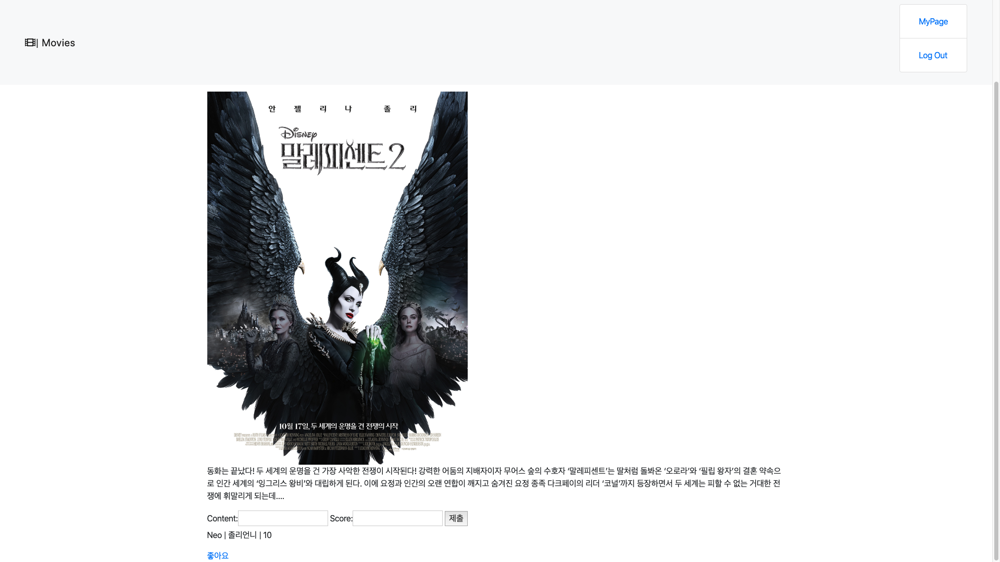

## Read Me PJT 07  박민기, 김지희

- settings.py에서 movies, accouts 앱을 추가하고 bootstrap 사용을 위해 STATICFILES_DIRS을 지정해준다. 또한 ``AUTH_USER_MODEL = 'accounts.User'``을 추가한다. 
- 지난 Instagram처럼 ``assets/css, assets/js`` 폴더를 추가해 bootstrap사용에 필요한 css, js 파일을 추가한다.


## account/views.py

```python
def index(request):
    users = User.objects.all()
    return render(request, 'accounts/index.html', {
        'users': users,
    })

@require_http_methods(['GET', 'POST'])
def signup(request):
    if request.user.is_authenticated:
        return redirect('/')
    if request.method == 'POST':
        form = CustomUserCreationForm(request.POST)
        if form.is_valid():
            user = form.save()
            auth_login(request, user)
            return redirect(user)
    else:
        form = CustomUserCreationForm()
    return render(request, 'accounts/signup.html', {
        'form': form, 
    })

@require_http_methods(['GET', 'POST'])
def login(request):
    if request.user.is_authenticated:
        return redirect('movies:movie_list')
    if request.method == 'POST':
        form = CustomAuthenticationForm(request, request.POST)
        if form.is_valid():
            auth_login(request, form.get_user())
            return redirect(request.GET.get('next') or 'movies:movie_list')
    else:
        form = CustomAuthenticationForm()
    return render(request, 'accounts/login.html', {
        'form': form,
    })

@login_required
def logout(request):
    if request.user.is_authenticated:
        auth_log_out(request)
    return redirect('movies:movie_list')

@login_required
def user_page(request, user_id):
    if request.user.is_authenticated:
        user = get_object_or_404(User, id=user_id)
        return render(request, 'accounts/detail.html', {
            'user_info': user,
        })
    return redirect('movies:movie_list')
```


## accounts/models.py

```python
class User(AbstractUser):
    email = models.EmailField(blank=True)
    first_name = models.CharField(max_length=100, blank=True)
    last_name = models.CharField(max_length=100, blank=True)

    def get_absolute_url(self):
        return reverse("accounts:user_page", kwargs={"user_id": self.pk})

    def __str__(self):
        return self.username
```


## movies/views.py

```python
def movie_list(request):
    movies = Movie.objects.all()
    return render(request, 'movies/movie_list.html',{
        'movies':movies,
    })

@require_GET
def movie_detail(request, movie_id):
    movie = get_object_or_404(Movie, id = movie_id)
    reviews = movie.review_set.all()
    review_form = ReviewModelForm()
    return render(request, 'movies/movie_detail.html', {
        'movie':movie,  
        'reviews':reviews,
        'review_form':review_form,
    })

@require_POST
@login_required
def reviews_new(request, movie_id):
    movie = get_object_or_404(Movie, id=movie_id)
    form = ReviewModelForm(request.POST)
    if form.is_valid():
        review = form.save(commit=False)
        review.user = request.user
        review.movie = movie
        review.save()
    return redirect('movies:movie_detail', movie_id)
    
@login_required
def reviews_delete(request, movie_id, reviews_id):
    movie = get_object_or_404(Movie, movie_id)
    review = get_object_or_404(Review, review_id)
    if request.user == review.user: 
        review.delete()
        return redirect('movies:movie_detail', movie_id)

@login_required
def like(request, movie_id):
    movie = get_object_or_404(Movie, id=movie_id)
    user = request.user
    if user in movie.like_users.all():  
        movie.like_users.remove(user)   
    else:
        movie.like_users.add(user)
    return redirect('movies:movie_detail', movie_id)

```

## movies/models.py

```python
User = get_user_model()

class Genre(models.Model):
    name = models.CharField(max_length=200)


class Movie(models.Model):
    title = models.CharField(max_length=200)
    audience = models.IntegerField()
    poster_url = models.CharField(max_length=200)
    description = models.TextField()
    genre = models.ForeignKey(Genre, on_delete=models.CASCADE)
    like_users = models.ManyToManyField(User, related_name='like_movies', blank=True)
    def get_absolute_url(self):
        return reverse("movies:movie_detail", kwargs={"movie_id": self.id})


class Review(models.Model):
    content = models.CharField(max_length=50)
    score = models.IntegerField()
    movie = models.ForeignKey(Movie, on_delete=models.CASCADE)
    user = models.ForeignKey(User, on_delete=models.CASCADE, related_name='reviews')

    

```

- Movie에서 genre를 지정하기에 선언을 먼저 해준다.


## movies/forms.py

```python
class MovieModelForm(forms.ModelForm):
    title = forms.CharField(min_length=2)
    class Meta:
        model = Movie
        fields = '__all__'


class ReviewModelForm(forms.ModelForm):
    content = forms.CharField(min_length=2, max_length=200) 
    
    class Meta:
        model = Review
        fields = ('content','score',)
```


## Screenshots

### ``accounts`` App

-   ``/accounts/`` sign up 화면
    -   

-   ``/accounts/login/`` (log in 화면)
    -   

- ``/accounts/`` (user 목록 화면)
    - 
- ``/accounts/user_page/<int:user_id>/`` (user 상세보기 화면)
    - 

### ``movies`` App

-   ``/movies/`` (영화 목록)
    -   
-   ``/movies/{movie_pk}/`` (영화 상세보기)
    -   
-   존재하지 않는 영화 상세보기 오류 페이지
    -   
-   영화 평점 생성 후
    -   
-   영화 좋아요 누른 후
    -   


## review

- 공동 프로젝트였기에 push와 pull을 함에 있어 더욱 신경썼어야 했다. 지난번과 비슷한 과정의 프로젝트였기에 git을 활용하는 것 외엔 어려움이 크게 없었다고 느낀 프로젝트였습니다. 확실히 프로젝트를 진행하며 계속해서 욕심이 생겨 많은 기능을 활용하고 싶어 계속 공부를 하게 된 것 같습니다.

