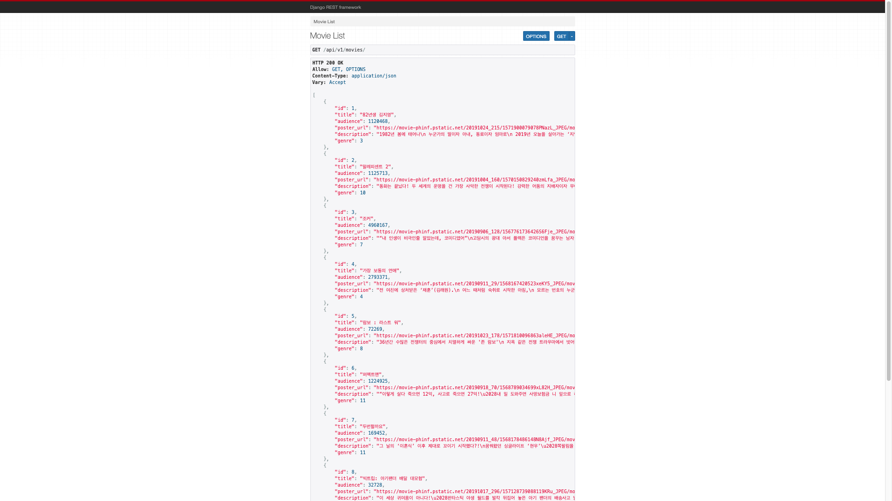

# Project 08 | 191101

Project 08 은 API 에 대한 이해, RESRful API 서버 구축 및 API 문서화를 구현하는데 목표를 둔다.

## Prerequisites

-   ``requirements.txt`` 를 활용하여 해당 프로젝트에 필요한 pip 를 정리하였다.

## pjt08

### settings.py

-   database 프로그램을 바꿔 끼고 싶으면 다음에서 ``db.sqlite3`` 만 바꿔 주면 된다

    ```python 
    DATABASES = {
        'default': {
            'ENGINE': 'django.db.backends.sqlite3',
            'NAME': os.path.join(BASE_DIR, 'db.sqlite3'),
        }
    }
    ```

### urls.py

-   생성한 app 에 대한 url 을 등록 해준다.

    -   ```python
        from django.contrib import admin
        from django.urls import path, include
        
        urlpatterns = [
            path('admin/', admin.site.urls),
            path('api/v1/', include('movies.urls')),
        ]
        ```


## Movies

### models.py

-   입력받은 정보들에 대한 모델을 정의 해준다.

    ```python
    from django.db import models
    
    class Genre(models.Model):
        name = models.CharField(max_length=20)
    
    class Movie(models.Model):
        title = models.CharField(max_length=200)
        audience = models.IntegerField()
        poster_url = models.CharField(max_length=200)
        description = models.TextField()
        genre = models.ForeignKey(Genre, on_delete=models.CASCADE)
    
    class Review(models.Model):
        content = models.CharField(max_length=200)
        score = models.IntegerField()
        movie = models.ForeignKey(Movie, on_delete=models.CASCADE)
    ```

### urls.py

-   ``/movies/`` path 를 타고 들어온 요청에 대한 세부 url 을 작성 해준다.

    ```python
    from django.urls import path
    from . import views
    
    from drf_yasg.views import get_schema_view
    from drf_yasg import openapi
    schema_view = get_schema_view(
        openapi.Info(
            title='Movie API',
            default_version='v1'
        )
    )
    app_name = 'movies'
    
    urlpatterns = [
        path('genres/', views.genre_list, name='genre_list'),
        path('genres/<int:genre_id>/', views.genre_detail, name='genre_detail'),
        path('movies/', views.movie_list, name='movie_list'),
        path('movies/<int:movie_id>/', views.movie_detail, name='movie_detail'),
        path('movies/<int:movie_id>/reviews/', views.create_review, name='create_review'),
        path('reviews/<int:review_id>/', views.update_or_delete_review, name='update_or_delete_preview'),
    ] + [
        path('docs/', schema_view.with_ui('redoc'), name='api_docs'),
        path('swagger/', schema_view.with_ui('swagger'), name='api_swagger'),
    ]
    
    ```

### views.py

-   들어오는 요청을 처리할 함수를 작성해준다.

    ```python
    from django.shortcuts import render, get_object_or_404
    # DRF import
    from rest_framework.response import Response
    from rest_framework.decorators import api_view
    
    from .models import Genre, Movie, Review
    from .serializers import GenreSerializer, MovieSerializer, ReviewSerializer
    
    
    @api_view(['GET'])
    def genre_list(request):
        genres = Genre.objects.all()
        genres_serializer = GenreSerializer(genres, many=True)
        return Response(genres_serializer.data)
    
    
    @api_view(['GET'])
    def genre_detail(request, genre_id):
        genre = get_object_or_404(Genre, id=genre_id)
        genre_serializer = GenreSerializer(genre)
        return Response(genre_serializer.data)
    
    
    @api_view(['GET'])
    def movie_list(request):
        movies = Movie.objects.all()
        movies_serializer = MovieSerializer(movies, many=True)
        return Response(movies_serializer.data)
    
    
    @api_view(['GET'])
    def movie_detail(request, movie_id):
        movie = get_object_or_404(Movie, id=movie_id)
        movie_serializer = MovieSerializer(movie)
        return Response(movie_serializer.data)
    
    
    @api_view(['POST'])
    def create_review(request, movie_id):
        movie = get_object_or_404(Movie, id=movie_id)
        review_serializer = ReviewSerializer(data=request.data)
        if review_serializer.is_valid(raise_exception=True):
            review_serializer.save(movie=movie)
        return Response({'message': '작성되었습니다'})
    
    
    # @api_view(['PUT','DELETE'])
    @api_view(['PATCH','DELETE'])
    def update_or_delete_review(request, review_id):
        review = get_object_or_404(Review, id=review_id)
        if request.method == 'PATCH':
            review_serializer = ReviewSerializer(data=request.data, instance=review)
            if review_serializer.is_valid(raise_exception=True):  # NOT VALID => ERROR
                review_serializer.save()
                return Response({'message': '수정되었습니다.'})
        else:
            review.delete()
            return Response({'message': '삭제되었습니다.'})
    ```

    


## screenshots

-   