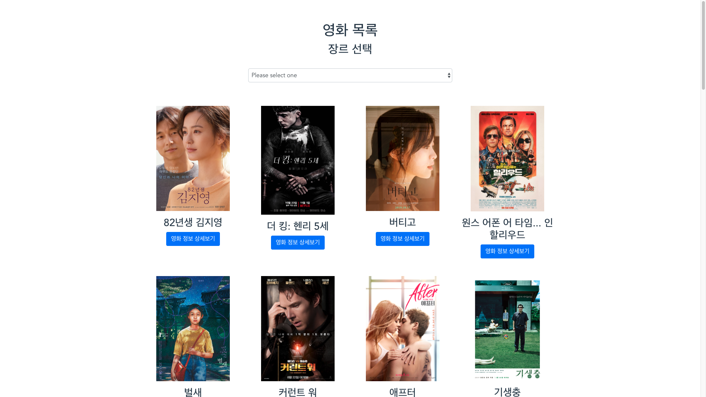
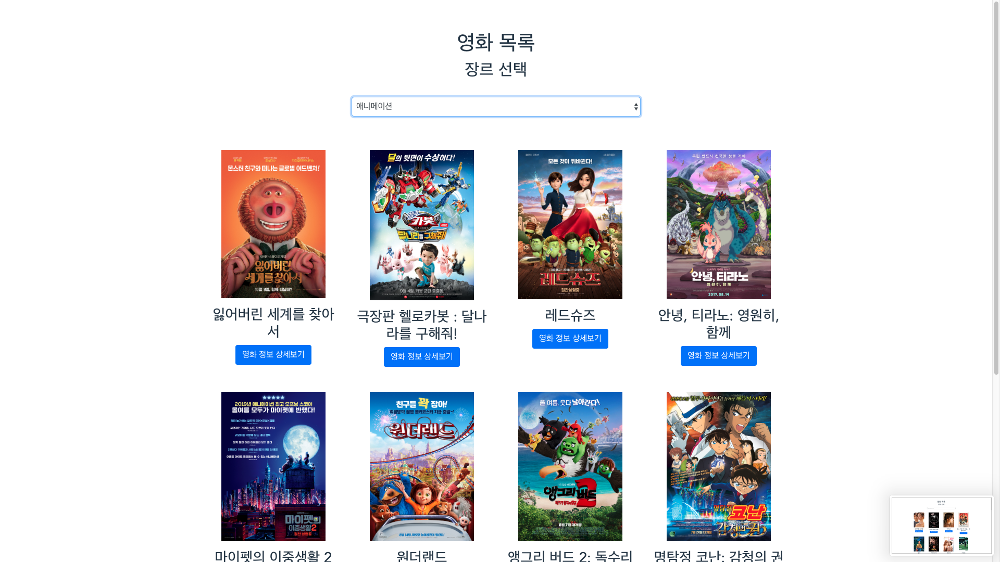
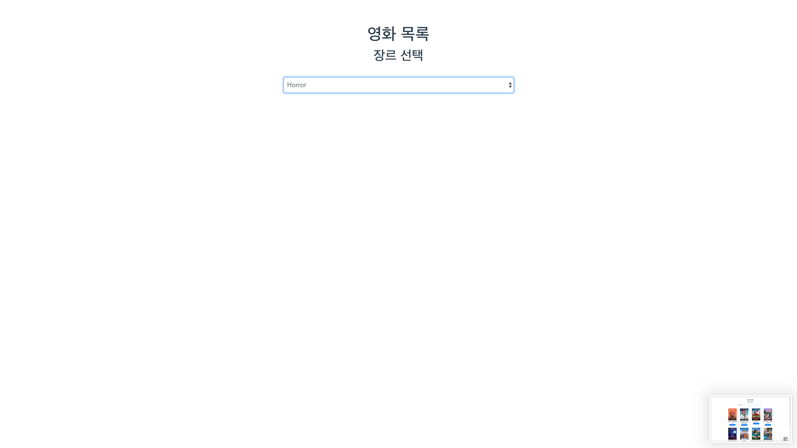

# Project 09 | 191120

## App.vue 

-   최상위 컴포넌트로 실행되는 시점에 외부로부터 데이터를 비동기적으로 받아온다.

    -   axis 를 활용하여 JSON 데이터를 받는다.

    ```vue
    <template>
      <div id="app">
        <div class="container">
        <MovieList :movies="movies" :genres="genres" />
        </div>
      </div>
    </template>
    
    <script>
    const axios = require('axios')
    
    import MovieList from './components/movies/MovieList';
    const HOST = 'http://localhost:3000/';
    
    export default {
      name: 'app',
      components: {
        MovieList,
      },
      data() {
        return {
          movies: [],
          genres: [],
        }
      },
    
      mounted() {
        axios.get(HOST + 'movies')
          .then(res => this.movies = res.data);
        axios.get(HOST + 'genres')
          .then(res => this.genres = res.data);
      },
    }
    </script>
    
    <style>
    #app {
      font-family: 'Avenir', Helvetica, Arial, sans-serif;
      -webkit-font-smoothing: antialiased;
      -moz-osx-font-smoothing: grayscale;
      text-align: center;
      color: #2c3e50;
      margin-top: 60px;
    }
    </style>
    ```


## MovieList.vue

-   영화 목록을 구성하는 컴포넌트이며, 장르에 따라 서로 다른 영화 목록을 출력한다.

-   개별 영화 컴포넌트를 반복하여 배치하는 작업을 진행한다.

-   드롭다운을 통한 장르 선택시 필터링 된 영화들을 실시간으로 변경하여 출력한다.

    -   이 경우, ``v-shwow`` 를 활용하여, 모든 정보를 받아 오지만, 선택한 장르의 영화만 화면에 보일 수 있도록 설정하였다.
    -   미선택시에는 ``selectedGenreId`` 의 value 값을 ``0`` 으로 설정하여 모든 영화를 출력할 수 있도록 하였다.

-   개별 영화 정보들을 다음의 컴포넌트로 각각 전달한다.

-   ```vue
    <template>
      <div>
        <h1>영화 목록</h1>
        <h2>장르 선택</h2>
        <select v-model="selectedGenreId" class="form-control">
          <option value="" >Please select one</option>
          <option v-for="genre in genres" :key="genre.id" :value="genre.id">
              {{ genre.name }}
          </option>
        </select>
        <div class="row">
          <MovieListItem v-show="selectedGenreId === movie.genre_id || !selectedGenreId" v-for="movie in movies" :key="movie.id" :movie="movie" />
        </div>
      </div>
    </template>
    
    <script>
    import MovieListItem from './MovieListItem'
    
    export default {
      name: 'MovieList',
      components: {
        MovieListItem,
      },
      data () {
        return {
          selectedGenreId: "",
        }
      },
      props: {
        movies: Array,
        genres: Array,
      }
    }
    </script>
    
    <style>
    select {
      display: block;
      width: 50% !important;
      margin: 2rem auto !important;
    }
    </style>
    ```


## MovieListItem.vue

-   개별 영화를 포스터/제목/상세보기 버튼으로 구성한 컴포넌트이다.

-   영화 상세보기 버튼을 누르면 MovieListItemModal.vue 를 확인할 수 있다.

-   해당 영화 정보를 다음의 컴포넌트로 전달한다

-   ```vue
    <template>
      <div class="col-3 my-3">
        
        <h3>{{ movie.name }}</h3>
        <button class="btn btn-primary" data-toggle="modal" :data-target="`#movie-${movie.id}`">영화 정보 상세보기</button>
        <MovieListItemModal :movie="movie" />
      </div>
    </template>
    
    <script>
    import MovieListItemModal from './MovieListItemModal';
    
    export default {
      name: 'MovieListItem',
      components: {
        MovieListItemModal,
      },
      props: {
        movie: Object,
      },
      data () {
        return {}
      }
    }
    </script>
    
    <style>
    .movie--poster {
      width: 200px;
    }
    </style>
    ```


## MovieListItemModal.vue

-   영화 정보 상세보기를 누르면 보이는 컴포넌트이다.

-   활용 가능한 데이터들을 확인하고, 원하는 위치에 출력한다.

-   ```vue
    <template>
    <div class="modal fade" tabindex="-1" role="dialog" :id="`movie-${movie.id}`">
      <div class="modal-dialog" role="document">
        <div class="modal-content">
          <div class="modal-header">
            <h5 class="modal-title">{{ movie.name }}</h5>
            <button type="button" class="close" data-dismiss="modal" aria-label="Close">
              <span aria-hidden="true">&times;</span>
            </button>
          </div>
          <div class="modal-body">
            <p>{{ movie.description }}</p>
          </div>
          <div class="modal-footer">
            <button type="button" class="btn btn-secondary" data-dismiss="modal">Close</button>
          </div>
        </div>
      </div>
    </div>
    </template>
    
    <script>
    export default {
      name: 'MovieListItemModal',
      props: {
        movie: Object,
      }
    }
    </script>
    
    <style>
    
    </style>
    ```


## screenshot

-   장르 미 선택시 아래와 같이 모든 영화를 출력한다.
    -   

-   원하는 장르 선택시, 선택된 장르에 해당되는 영화만 출력한다.
    -   

-   해당 장르에 등록된 영화가 없으면 아무것도 출력되지 않는다.
    -   