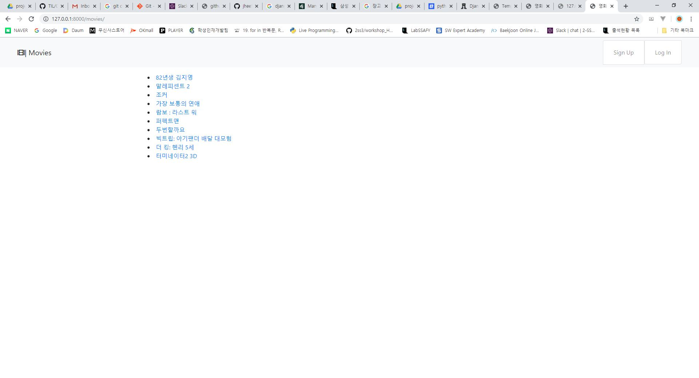

# PJT 10: Django- Pair Programming

## 기본적인 세팅 (pjt10/settings.py)

- 우선 기본적으로 project 와 app 생성 후, settings에 'movies', 'accounts'를 / master_urls에 
    path('movies/', include('movies.urls')), path('accounts/', include('accounts.urls'))를 추가해줬습니다.
    또한 base.html을 공통으로 쓰기 위해 'DIRS'에  [os.path.join(BASE_DIR, 'templates'),], 를 추가해줬습니다.


## Movies

### 1. Movies Models

```python
from django.db import models
from django.contrib.auth import get_user_model
from django.urls import reverse

User = get_user_model()

# Create your models here.

class Genre(models.Model):
    name = models.CharField(max_length=200)


class Movie(models.Model):
    title = models.CharField(max_length=200)
    audience = models.IntegerField()
    poster_url = models.CharField(max_length=200)
    description = models.TextField()
    genre = models.ForeignKey(Genre, on_delete=models.CASCADE)
    like_user = models.ManyToManyField(User, related_name='like_movies')
    
    def get_absolute_url(self):
        return reverse("movies:movie_detail", kwargs={"movie_id": self.id})
    

class Reviews(models.Model):
    content = models.CharField(max_length=200)
    score = models.IntegerField()
    movie = models.ForeignKey(Movie, on_delete=models.CASCADE)
    user = models.ForeignKey(User, on_delete=models.CASCADE)
```

- 1:N 관계의 장르 모델과 무비 모델 생성
- 1:N 관계의 무비 모델과 리뷰 모델 생성
- 유저와 좋아요의 M:N 관계 설정

### 2. Movies Form

```python
from .models import Reviews
from django import forms

class ReviewsModelForm(forms.ModelForm):
    class Meta:
        model = Reviews
        fields = ('content', 'score',)

```

- 생성 기능이 있는 Review에만 ReviewsModelForm 생성
- 사용자가 Review의 content와 score만 입력할 수 있도록 설정

### 3. Movies URL

```python
from django.urls import path
from . import views

app_name = 'movies'

urlpatterns = [
    path('', views.movies_list, name='movies_list'),
    path('<int:movie_id>/', views.movie_detail, name='movie_detail'),
    path('<int:movie_id>/review/new/>', views.create_review, name='create_review'),
    path('<int:movie_id>/review/<int:review_id>/delete/', views.delete_review, name='delete_review'),
    path('<int:movie_id>/like/', views.like_movie, name='like_movie'),
]
```


- 영화 목록 페이지와 영화 상세 정보 조회 페이지 URL
- 영화 리뷰 생성 및 삭제 URL 생성
- 좋아요 및 좋아요 취소 URL 생성

### 4. Movies Views & HTML

```python
def movies_list(request):
    movies = Movie.objects.all()
    return render(request, 'movies/list.html', {
        'movies': movies
    })


def movie_detail(request, movie_id):
    movie = get_object_or_404(Movie, id=movie_id)
    reviews = movie.reviews_set.all()
    review_form = ReviewsModelForm()
    return render(request, 'movies/detail.html', {
        'movie': movie,
        'reviews': reviews,
        'review_form': review_form
    })
```

- 영화 정보 목록 페이지 VIEW

- 영화 상세 정보 페이지: 작성된 리뷰들과 리뷰 작성 FORM을 함께 보여줌

  ```django
  
  
   영화 목록 
  
  
  
  <li>
  <a href="">{{ movie.title }}</a>
  </li>
  
  
  ```

- 영화 정보 목록 페이지 HTML

```django



영화 상세 정보



<h1>{{ movie.title }}</h1>

<h3>관객수: {{ movie.audience }}</h3>
<h3>장르: {{ movie.genre.name }}</h3>
<p>줄거리: {{ movie.description }}</p>
```

- 영화 상세 정보 HTML

  ```python
  @login_required
  @require_POST
  def create_review(request, movie_id):
      movie = get_object_or_404(Movie, id=movie_id)
      if request.method == 'POST':
          review_form = ReviewsModelForm(request.POST)
          if review_form.is_valid():
              review = review_form.save(commit=False)
              review.user = request.user
              review.movie = movie
              review.save()
              return redirect(movie)
      return redirect('movies:movies_list')
  
  
  @login_required
  @require_POST
  def delete_review(request, movie_id, review_id):
      review = get_object_or_404(Reviews, id= review_id)
      if review.user == request.user:
          review.delete()
      return redirect('movies:movie_detail', movie_id)
  
  
  ```

  

- 리뷰 상세 및 삭제 VIEW 생성

```django
<div>
<form action="" method='POST'>
    
    {{ review_form }}
    <button type="submit">작성</button>
</form>
</div>
<div>

    <p> {{ review.user }} : {{ review.content }} || {{ review.score }} </p>
    <form action="" method='POST'>
    
    
    <button type="submit">삭제</button>
    
    </form>

</div>

```

- VIEW에서 보낸 REVIEW_FORM으로 리뷰 작성 FORM 생성

- 영화에 생성된 모든 리뷰 표시 

- 리뷰 작성자와 현재 사용자가 같다면 삭제 버튼 보여주고 VIEW에서 한 번 더 판단해서 삭제 가능

  ```python
  @login_required
  def like_movie(request, movie_id):
      movie = get_object_or_404(Movie, id=movie_id)
      user = request.user
      if movie.like_user.filter(id=user.id).exists():
          movie.like_user.remove(user)
      else:
          movie.like_user.add(user)
      return redirect(movie)
  ```

- 영화 좋아요 및 좋아요 취소 VIEW

- 좋아요를 이미 눌렀으면 좋아요 취소가 됨

```python
<div>
<form action="" method='POST'>
    
    
    <button type="submit">좋아요 취소</button>
    
    <button type="submit">좋아요</button>
    
</form>
</div>
```

- 좋아요 DETAIL HTML
- 좋아요를 눌렀으면 좋아요 취소 버튼이, 좋아요를 안 눌렀으면 좋아요 버튼이 뜸


## Accounts

### 1. accounts/views.py

```python
from django.shortcuts import render, redirect, get_object_or_404
from django.views.decorators.http import require_GET, require_http_methods, require_POST
from django.contrib.auth import login as auth_login, logout as auth_log_out
from django.contrib.auth.decorators import login_required

from .forms import CustomAuthenticationForm, CustomUserCreationForm
from movies.models import Reviews

from django.contrib.auth import get_user_model
User = get_user_model()
```

-   회원 목록을 확인할 수 있는 ``index``

    -   ```python
        def index(request):
            users = User.objects.all()
            return render(request, 'accounts/index.html', {
                'users': users,
            })
        ```

-   회원 가입을 위한 ``signup`` url 생성

    -   ```python
        @require_http_methods(['GET', 'POST'])
        def signup(request):
            if request.user.is_authenticated:
                return redirect('accounts:index')
            if request.method == 'POST':
                form = CustomUserCreationForm(request.POST)
                if form.is_valid():
                    user = form.save()
                    auth_login(request, user)
                    return redirect('accounts:index')
            else:
                form = CustomUserCreationForm()
            return render(request, 'accounts/signup.html', {
                'form': form, 
            })
        ```

-   로그인, 로그아웃 을 위한 ``login``, ``logout`` url 생성

    -   ```python
        @require_http_methods(['GET', 'POST'])
        def login(request):
            if request.user.is_authenticated:
                return redirect('/')
            if request.method == 'POST':
                form = CustomAuthenticationForm(request, request.POST)
                if form.is_valid():
                    auth_login(request, form.get_user())
                    return redirect(request.GET.get('next') or 'movies:movies_list')
            else:
                form = CustomAuthenticationForm()
            return render(request, 'accounts/login.html', {
                'form': form,
            })
        
        
        @login_required
        def logout(request):
            if request.user.is_authenticated:
                auth_log_out(request)
            return redirect('movies:movies_list')
        ```

-   팔로우 기능을 위한 ``follow`` url 생성

    -   ```python
        @login_required
        @require_POST
        def follow(request, user_id):
            fan = request.user
            star = get_object_or_404(User, id=user_id)
            if fan != star:
                if star.fans.filter(id=fan.id).exists():
                    star.fans.remove(fan)
                else:
                    star.fans.add(fan)
            return redirect(star)
        ```

-   유저 상세 정보를 확인 할 수 있는 ``user_page`` url 생성

    -   ```python
        @login_required
        @require_GET
        def user_page(request, user_id):
            if request.user.is_authenticated:
                user = request.user
                detail_user = get_object_or_404(User, id=user_id)
                fans = detail_user.fans.all().count()
                stars = detail_user.star.all().count()
                is_like = detail_user.fans.filter(id=user.id).exists()
                reviews = Reviews.objects.filter(user=detail_user)
                return render(request, 'accounts/detail.html', {
                    'user_info': detail_user,
                    'fans': fans,
                    'stars': stars,
                    'is_like': is_like,
                    'reviews': reviews,
                })
            return redirect('movies:movies_list')
        ```

        

### 2. accounts/urls.py

```python
from django.urls import path
from . import views

app_name = 'accounts'

urlpatterns = [
    path('', views.index, name='index'),
    
    path('signup/', views.signup, name='signup'),
    path('login/', views.login, name='login'),
    path('logout/', views.logout, name='logout'),

    path('follow/<int:user_id>/', views.follow, name='follow'),

    path('<int:user_id>/', views.user_page, name='user_page'),
]
```

-   회원 목록을 확인 할 수 있는 ``index`` url 생성
-   회원 가입을 위한 ``signup`` url 생성
-   로그인, 로그아웃 을 위한 ``login``, ``logout`` url 생성
-   팔로우 기능을 위한 ``follow`` url 생성
-   유저 상세 정보를 확인 할 수 있는 ``user_page`` url 생성

### accounts/models.py

```python
from django.db import models
from django.urls import reverse

from django.contrib.auth.models import AbstractUser
from django.conf import settings


class User(AbstractUser):
    fans = models.ManyToManyField('accounts.User', related_name='star')
    def get_absolute_url(self):
        return reverse("accounts:user_page", kwargs={"user_id": self.pk})
    
    def __str__(self):
        return self.username
```

-   Django 에 내장된 User 모델을 활용하기 위하여 ``AbstractUser`` 를 import 해왔다.
-   follow 기능을 추가 하기 위하여 ``fans`` 항목을 추가로 작성하였다. 이 때, 다대다 관계를 형성하기 위하여 ``ManyToManyField`` 를 활용하였다.

### 3. accounts/forms.py

```python
from django.contrib.auth.forms import UserCreationForm, UserChangeForm, AuthenticationForm

from django.contrib.auth import get_user_model
User = get_user_model()


class CustomUserCreationForm(UserCreationForm):
    class Meta:
        model = User
        fields = ('username', 'email', 'first_name', 'last_name', )


class CustomAuthenticationForm(AuthenticationForm):
    class Meta:
        model = User
```

-   회원 가입과 로그인 때 필요한 form은 django 에 내장된 form 을 활용하였다.


## 페어 프로그래밍 후 느낀점

- 내가 쓴 코드를 push하기 전에 pull 하는 것이 중요하다고 느꼈습니다. push 전 pull을 습관화 해야겠다고 생각했습니다.
- commit 할 때, 파트너가 보고 바로 이해할 수 있게 작성해야 원활한 프로그래밍이 된다고 느꼈습니다. 자세하고, 명확한 commit message를 써야겠다고 생각했습니다.
- merge를 해야할 상황이 자주 오기 때문에, 파트너와 진행상황을 commit message 등으로 충분히 공유 및 소통해야 한다고 생각했습니다.

## Screenshots

-   회원 가입
    -   
-   로그인
    -   
-   회원 목록
    -   

-   회원 상세 정보
    -   

-   영화 목록
    -   
-   영화 상세 정보
    -   

